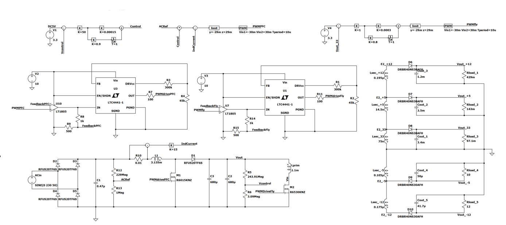

# ATX Power Supply

## Portfolio Pages

[Home Page](index.md)

[Remote Controllable Rover](Rover.md)

[ATX Power Supply](ATX.md)

[Robotic Arm](RoboticArm.md)

[ISSIE Circuit Simulator](Issie.md)

[Soft Switching Power Supply](SoftSwitching.md)

## Project Summary

The goal of this project is to create a working power supply with an isolated output with multiple voltage rails. This project took around 2 months worth of work to do with my teammate.

The final product passes the EN6100 Class A Harmonics qualifications, so it will be able to be plugged into any UK mains socket.

## Images

## Links

[Repo for code and sim](https://github.com/ck1419/ATX_PowerSupply)

[My teammate](https://github.com/yannichau)
