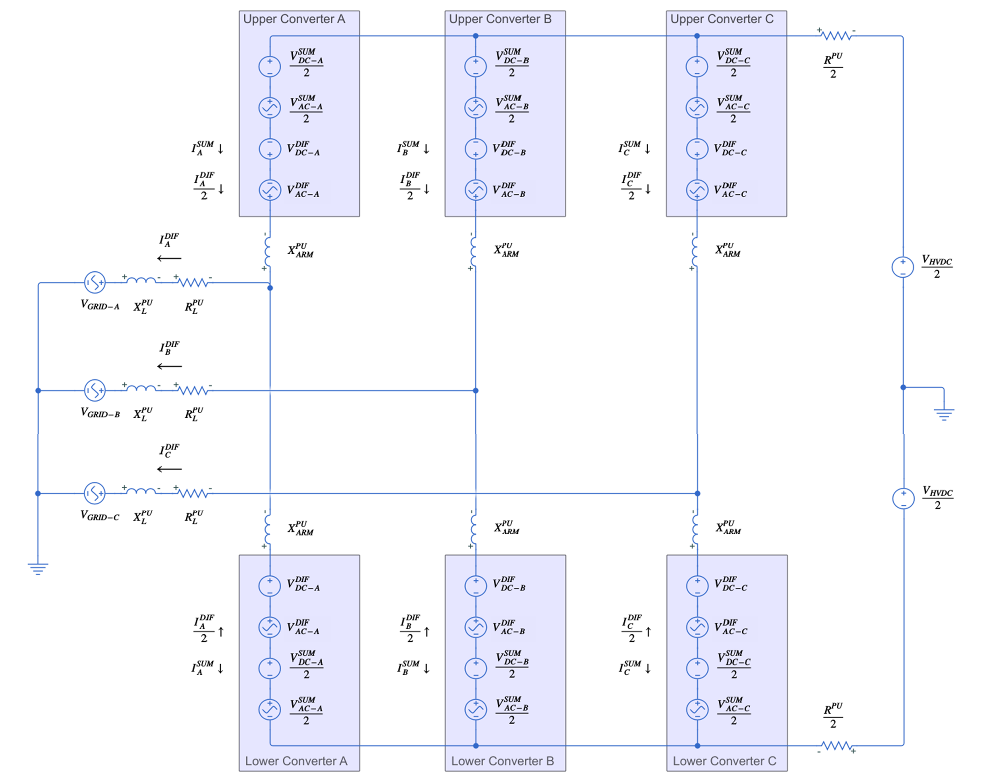
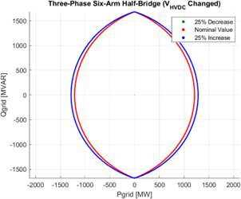
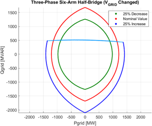
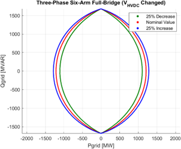

# Energy Control of a Modular Multilevel Converter for HVDC using an Optimal Power Flow Algorithm

## Portfolio Pages

[Home Page](index.md)

## Project Summary

This project attempts to formulate a high voltage direct current (HVDC) modular multilevel converter (MMC) as a power flow problem that can be solved numerically. This process includes making a model for a single-phase single-arm converter, which can then be scaled up into a single-phase two-arm converter and then the final three-phase six-arm converter.

## Images From The Project

Three-Phase HVDC Converter Model

Operational region of a three-phase six-arm Results using the Xiangjiaba-Shanghai HVDC converter's parameters

 

 

## Project Links

[Repo for Code](https://github.com/ck1419/FYP-CODE)