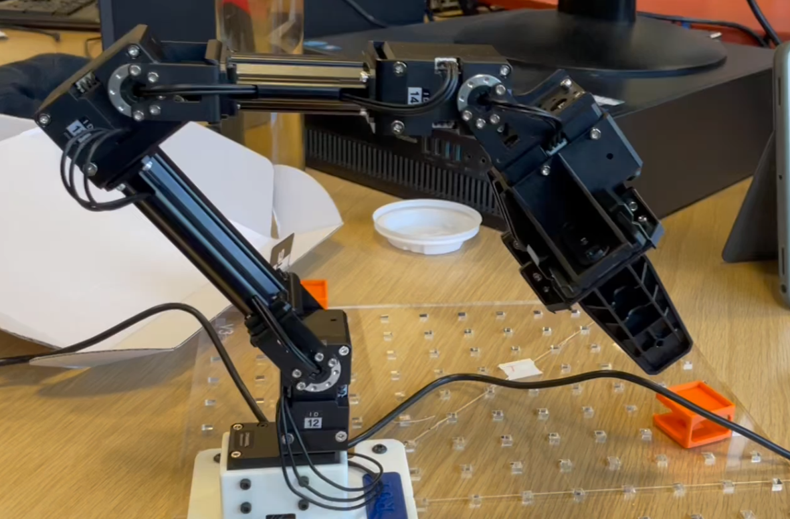

# Manipulatable Robotic Arm

## Portfolio Pages

[Home Page](index.md)

[Remote Controllable Rover](Rover.md)

[ATX Power Supply](ATX.md)

[Robotic Arm](RoboticArm.md)

[ISSIE Circuit Simulator](Issie.md)

[Soft Switching Power Supply](SoftSwitching.md)

## Project Summary

This project aimed to create a 4DOF manipulatable robotic arm using inverse kinematics. The ultimate goal was to allow the arm to grasp any object and perform any task easily by feeding in instructions using our own custom commands.

By the end of the project, we managed to make the robot arm grasp any object from any reachable position, and place it in any orientation to any spot. The robot was also able to do custom tasks, such as dealing out playing cards to players.

## Images

## Links

[Repo for code and sim](https://github.com/ib619/DORAEMON)

[My teammate](https://github.com/yannichau)

[My teammate](https://github.com/ib619)
