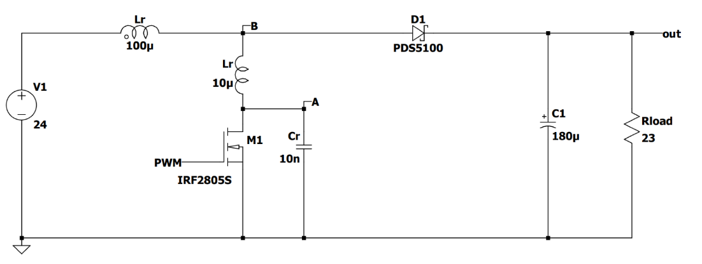
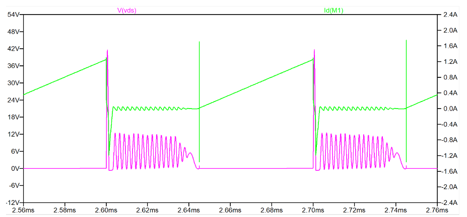
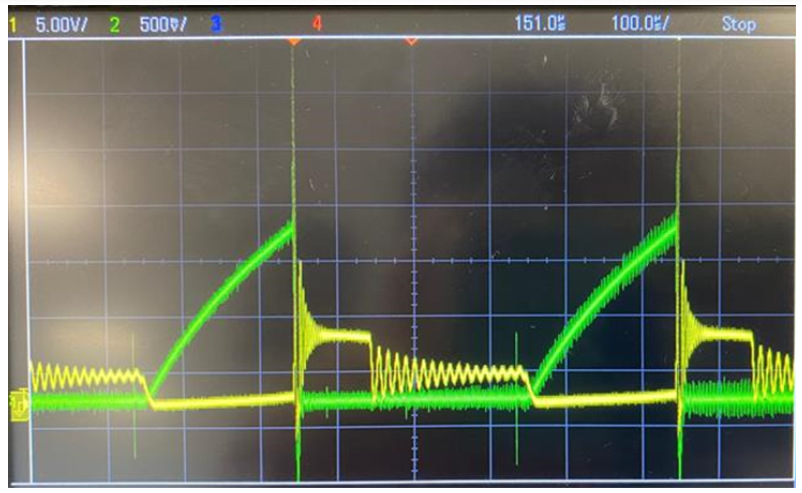

# Soft Switching Power Supply

## Portfolio Pages

[Home Page](index.md)

[Remote Controllable Rover](Rover.md)

[ATX Power Supply](ATX.md)

[Robotic Arm](RoboticArm.md)

[ISSIE Circuit Simulator](Issie.md)

[Soft Switching Power Supply](SoftSwitching.md)

## Project Summary

The goal of this project is to directly improve the efficiency of a regular boost converter by adding soft switching capabilities to reduce the losses incurred during MOSFET switching.

In the final design, we managed to reduce the total losses by around 20%

## Images

## Links

[Repo for code](https://imperiallondon-my.sharepoint.com/personal/ykh19_ic_ac_uk/_layouts/15/onedrive.aspx?id=%2Fpersonal%2Fykh19%5Fic%5Fac%5Fuk%2FDocuments%2F3rd%20Year%20Group%20Project%20Soft%20Switching%20Converter&FolderCTID=0x012000753EFD42AF7D9F489B4D5C625CE104D6)

My teammates:

- Nitu Barua
- Oskar Mason
- Qi Ziheng
- Yeong Kyun Han
