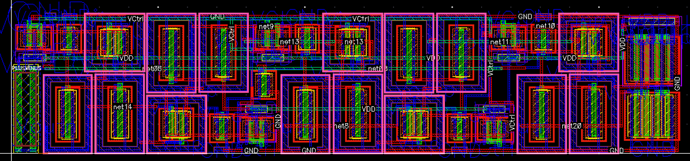
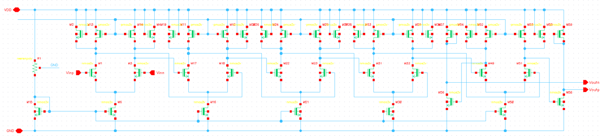
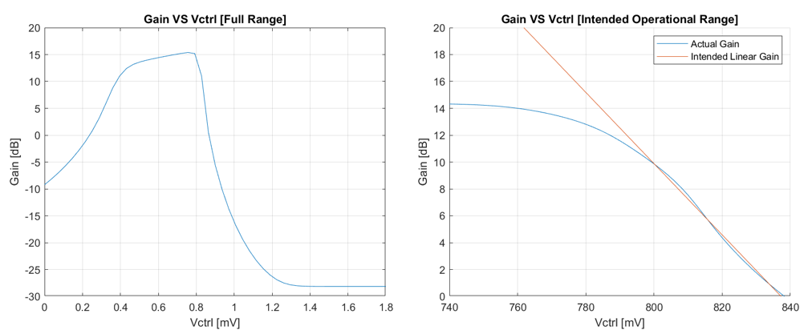

# Analogue Variable Gain Amplifier Chip Design

## Portfolio Pages

[Home Page](index.md)

## Project Summary

This project attempts to design an analogue based variable gain amplifier (VGA) in Cadence.

The designed VGA is a differential output, continuously variable, linear-in-dB voltage controlled variable gain amplifier. The gain of this chip can be varied over a 14.3dB range via a 740mV to 840mV control voltage.

## Results

